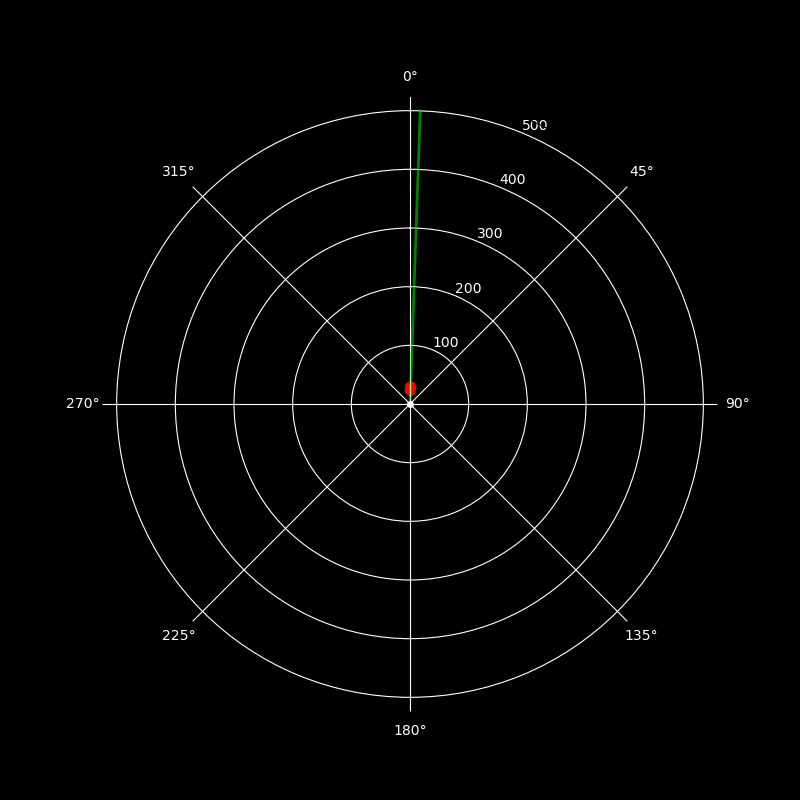
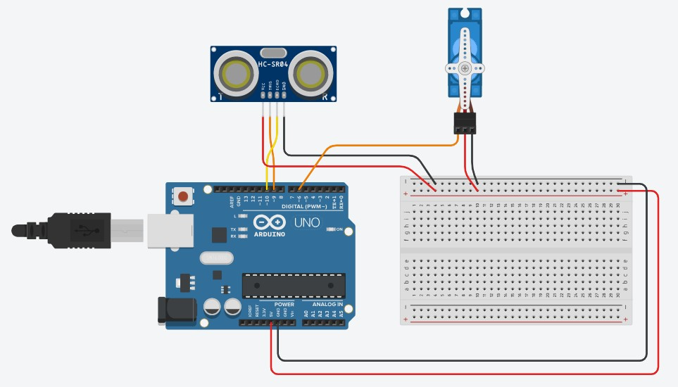

# Arduino Radar System 🛰️

A mini radar project using an Arduino UNO R4 Minima, an ultrasonic sensor mounted on a servo motor, and a real-time Python display that mimics a radar screen.

---

## 📸 Demo



---

## 🔌 Circuit Diagram

Below is the connection diagram for the Arduino radar setup:



### Connections

| Component         | Arduino Pin   | Notes                           |
|------------------|---------------|----------------------------------|
| Ultrasonic VCC   | 5V            | Power                            |
| Ultrasonic GND   | GND           | Ground                           |
| Ultrasonic TRIG  | D9            | Can be changed in code           |
| Ultrasonic ECHO  | D10           | Can be changed in code           |
| Servo Motor PWM  | D6            | Servo control signal             |
| Servo VCC        | 5V            | Use external 5V if needed        |
| Servo GND        | GND           | Common ground with Arduino       |

> 💡 Tip: Use a breadboard and jumper wires to keep the connections clean and secure.

---

## 📁 Project Structure
```
arduino-radar/
├── arduino/                # Arduino sketch 
│   └── radar.ino 
├── python/                 # Python radar display 
│   ├── radar_plot.py
│   ├── my-radar.py         # Basic radar plot 
│   ├── mock_serial.py
│   └── requirements.txt
├── media/
│   └── radar_demo.gif
├── README.md
└── LICENSE
```

---

## 🛠️ Hardware Used

- Arduino UNO R4 Minima
- HC-SR04 Ultrasonic Sensor
- SG90 Servo Motor
- Jumper Wires
- USB Cable
- A PC running Python

---

## 🚀 Getting Started

### 1. Upload the Arduino Code

Flash the Arduino with the sketch from the `arduino/` folder using the Arduino IDE.

### 2. Run the Python Display

Install dependencies:

```bash
cd python
pip install -r requirements.txt
```
Then run the radar UI:
```
python radar_plot.py
```
For testing without Arduino, use the included `mock_serial.py`.

---

## 🎯 Features
Real-time radar-style sweep animation

Green dots for normal detections

Red dots for close objects (< THRESHOLD_DISTANCE)

Audible beep alert for close-range detection

Text overlay of distance and angle

Captures frames and saves output as a .gif for demonstrations

---

## ⚙️ Customization
Change sweep speed, fade time, or detection threshold in `radar_plot.py`

Modify sound settings based on your OS

Replace MockSerial with actual Serial port for real data

---

## 📜 License
GNU GENERAL PUBLIC LICENSE (Version 3, 29 June 2007)

---

## 💡 Inspired By
This project was built as a fun DIY radar visualization using basic electronics and Python.
